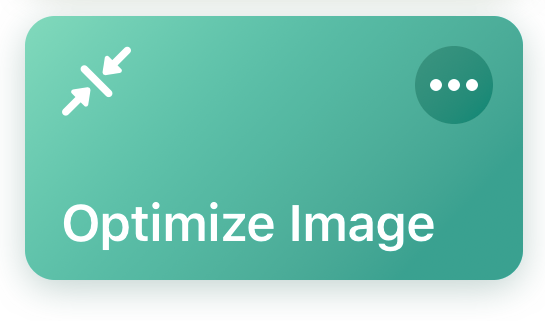
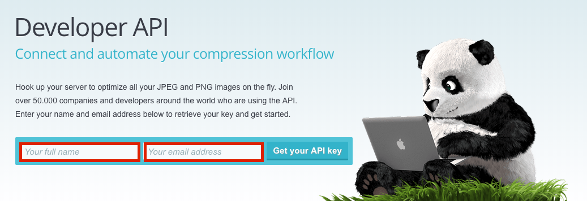
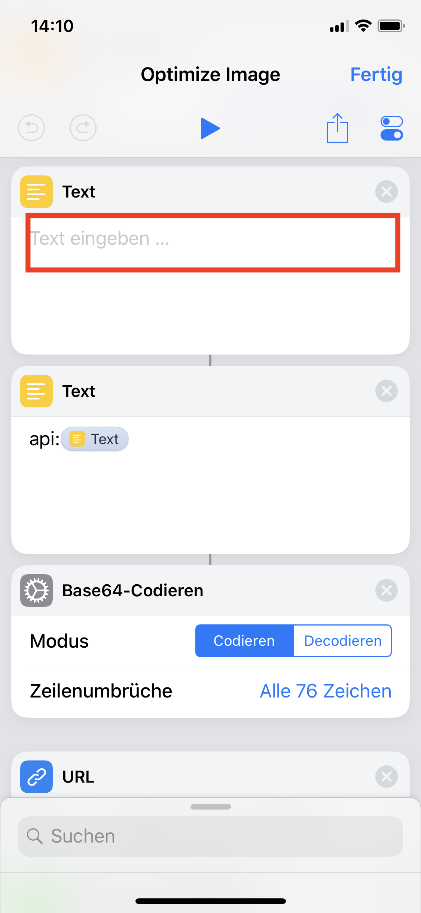

# Optimize Image

This is a shortcut for optimizing images with the TinyPNG Developer API.  

## Setup
First of all you need to create your personal API-Key for the TinyPNG Developer API.  
Go to [TinyPNG](https://tinypng.com/developers) an fill out the form.  
    

You'll receive an link to your TinyPNG dashboard.  
Here you grab your API-Key.  
  
The last step is to paste your personal API-Key into the shortcut. 
 

